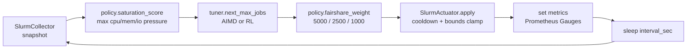
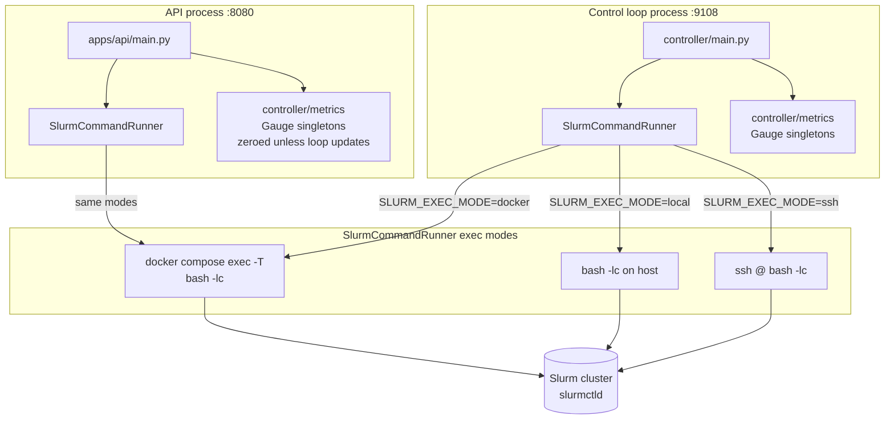

# adaptive-wlm-controller

`adaptive-wlm-controller` is a local-first, dependency-light MVP that runs a quota-aware adaptive
control loop over a Slurm cluster. Each interval it reads scheduler queue pressure, computes a
saturation score, selects a target job-concurrency limit via a pluggable tuner (AIMD by default,
tabular Q-learning RL optionally), enforces safety bounds and cooldowns, and — outside dry-run mode
— applies the change to Slurm via `sacctmgr` or `scontrol`. It emits Prometheus metrics, structured
logs, a REST control-plane API, and a lightweight dashboard. Slurm-only for now; IBM LSF is a
planned follow-on.


---

## Why / problem statement

HPC clusters running Slurm are routinely oversubscribed. Without active feedback, a single
burst of job submissions can saturate the queue, starve fair-share scheduling, and delay
all tenants. Manual tuning of `MaxJobsPU`, `GrpTRES`, and fairshare weights is slow and error-prone.

`adaptive-wlm-controller` closes the loop: it continuously measures queue pressure, adjusts
`MaxJobsPU` (or `MaxCPUsPerNode` for non-slurmdbd deployments), and backs off when the cluster
is saturated — without human intervention. All mutations are bounded, cooled-down, and gated
behind a dry-run default so the loop is safe to deploy and audit.

---

## Research basis and implementation strategy

The design follows the SelfTune philosophy (USENIX NSDI 2023): *measure, adjust, observe, repeat*.
Key decisions from `docs/RESEARCH_NOTES.md` and `docs/IMPLEMENTATION.md`:

- **AIMD first.** Additive-increase / multiplicative-decrease is deterministic, auditable, and
  safe under noisy signals. It provides a stable, production-proven baseline before RL is
  introduced.
- **Tabular Q-learning RL as an optional second tuner.** Tabular Q-learning stays
  dependency-free (stdlib only), auditable, and bounded by construction — using the same
  `{decrease, hold, increase}` action set as AIMD. No neural networks, no external RL libraries.
  For unseen states the RL tuner falls back to AIMD, so it is safe even before training.
- **Single `ControllerConfig` dataclass.** All tunables live in one place, read from env at
  import time. No hidden config files, no `load_config()` indirection.
- **Pluggable tuner contract.** Both tuners implement `next_max_jobs(current, saturation) -> int`.
  Switching tuners requires only setting `TUNER_KIND=rl`; the control loop is unchanged.
- **Explicit decomposition.** collector / policy / tuner / actuator are plain classes with no
  circular imports. The Slurm CLI boundary is a single choke point (`SlurmCommandRunner`).

See `docs/RESEARCH_NOTES.md` for RL design rationale and `docs/IMPLEMENTATION.md` for
implementation decisions and known-issue history.

---

## Architecture

```
controller/
  collectors/slurm.py   — SlurmCollector: snapshot() → ClusterSnapshot
  policy/engine.py      — pure saturation score + fairshare weight logic
  tuner/
    aimd.py             — AimdTuner (default)
    rl.py               — RLTuner (tabular Q-learning)
    rl_env.py           — QueueSimulator + train_rl()
    train.py            — entry point: python -m controller.tuner.train
    __init__.py         — build_tuner(cfg) → AimdTuner | RLTuner
  actuator/slurm.py     — SlurmActuator: apply() with cooldown + bounds
  simulator/replay.py   — offline policy evaluation from CSV trace
  workload/submitter.py — synthetic job submission helpers
  slurm_exec.py         — SlurmCommandRunner (docker / local / ssh)
  config.py             — ControllerConfig dataclass
  metrics.py            — Prometheus Gauge singletons
  types.py              — ClusterSnapshot, PolicyDecision, AppliedAction
  main.py               — control loop entry point

apps/
  api/main.py           — FastAPI control-plane (separate process)
  dashboard/            — static index.html served at /ui

infra/
  docker/               — single-container Slurm sandbox + docker-compose.yml
  prometheus/           — scrape config
  grafana/              — dashboard provisioning

scripts/
  up.sh / down.sh       — start / stop the sandbox stack
  submit-test-jobs.sh   — sbatch N sleep jobs
  e2e-check.sh          — up → submit → squeue/sacct verification

models/
  qtable.json           — trained Q-table (written by python -m controller.tuner.train)
```

---

## Architecture flow diagrams

### Per-interval control loop pipeline



### Slurm CLI boundary and process topology



Note: the control loop process and the API process are independent. The loop publishes metrics
on `:9108` via `start_http_server(9108)`. The API's `/metrics` endpoint exposes the gauges
registered in the API process, which are zeroed unless that process updates them independently.

---

## Internal data flow

### ClusterSnapshot construction

`SlurmCollector.snapshot()` shells three commands through `SlurmCommandRunner`:

1. `sinfo -h -o '%t'` — node state counts (idle, allocated, down, etc.)
2. `squeue -h -o '%T|%r'` — job state + reason (PENDING, RUNNING, etc.)
3. `sacct` — (best-effort, silently skipped on failure) historical accounting

From these it builds a `ClusterSnapshot` with `pending_jobs`, `running_jobs`, `total_nodes`,
and heuristic pressure values:

- `cpu_pressure = pending / (pending + running)` — direct queue ratio
- `mem_pressure` — heuristic function of pending/running counts (not real memory telemetry)
- `io_pressure` — heuristic function of pending/running counts (not real I/O telemetry)

### Pressure → saturation → target max-jobs

```
saturation_score = max(cpu_pressure, mem_pressure, io_pressure)

if saturation >= pressure_high (default 0.85):
    fairshare_weight = 5000
elif saturation <= pressure_low (default 0.45):
    fairshare_weight = 1000
else:
    fairshare_weight = 2500

AIMD tuner:
    if saturation >= pressure_high  →  next = max(floor, current // 2)   # multiplicative decrease
    elif saturation <= pressure_low →  next = min(ceil,  current + 1)     # additive increase
    else                            →  next = clamp(current, floor, ceil) # hold

RL tuner:
    same decrease/hold/increase actions, chosen by Q-table lookup
    unseen state → fall back to AIMD
```

### Where bounds and cooldown are enforced

Bounds `[max_jobs_floor, max_jobs_ceil]` are enforced in **two places**:
1. Inside both tuners (`AimdTuner.next_max_jobs`, `RLTuner.next_max_jobs`) — the returned value
   is always within bounds.
2. Inside `SlurmActuator.apply()` — re-clamps before issuing the command, regardless of tuner.

Cooldown lives exclusively in `SlurmActuator.apply()`. If `now - last_apply < cooldown_sec`,
the actuator returns immediately with `changed=False` and issues no commands.

### How dry-run gates mutation

`ControllerConfig.dry_run` defaults to `True`. In dry-run mode, `SlurmActuator.apply()` builds
the command strings and logs them with a `DRY_RUN` prefix but never calls
`SlurmCommandRunner.run()`. State (`max_jobs`, `priority_weight_fs`, `last_apply`) is still
updated in dry-run so the control loop behaves as if changes were applied, enabling realistic
simulation without touching the scheduler.

Only `--dry-run false` or `CONTROLLER_DRY_RUN=false` enables live mutation.

---

## Cheat sheet

### Install and lint/test

```bash
# Install (editable, with dev tools)
pip install -e ".[dev]"

# Lint
ruff check .

# Full test suite (182 tests)
pytest -q

# Single test file
pytest controller/tests/test_actuator.py -q

# Single test
pytest controller/tests/test_rl.py::test_bounds -q
```

### Run the control loop

```bash
# Dry-run (default — no Slurm mutations)
python -m controller.main --interval 15 --dry-run true

# Live mode (mutates Slurm — use only against a target you control)
python -m controller.main --interval 15 --dry-run false

# RL tuner: train first, then select
python -m controller.tuner.train                        # writes models/qtable.json (seed=42)
TUNER_KIND=rl python -m controller.main --dry-run true
```

### Run the API (separate process)

```bash
uvicorn apps.api.main:app --host 127.0.0.1 --port 8080
# endpoints: / /healthz /cluster/snapshot /metrics /ui
```

### Offline policy evaluation (no Slurm needed)

```bash
# CSV columns: pending_jobs,running_jobs,saturation
python -m controller.simulator.replay <trace.csv>
```

### Docker sandbox

```bash
./scripts/up.sh                   # build + start; waits for scontrol ping
./scripts/submit-test-jobs.sh 20  # sbatch 20 sleep jobs
./scripts/e2e-check.sh            # up → submit → squeue/sacct verification
./scripts/down.sh                 # down -v (removes volumes)
```

### Observability URLs (local sandbox)

| Service | URL | Default credentials |
|---|---|---|
| API / dashboard | http://localhost:8080/ui | — |
| API docs | http://localhost:8080/docs | — |
| Loop metrics | http://localhost:9108/metrics | — |
| Prometheus | http://localhost:9090 | — |
| Grafana | http://localhost:3000 | admin / admin |

---

## Configuration

All tunables come from environment variables read by `ControllerConfig` at **import time**.
Set them before importing the package (e.g., in `.env` sourced before the process starts, or via
`docker compose` environment). There is no `load_config()` function — runtime `os.environ`
changes after first import have no effect.

Copy `.env.example` to `.env` as a starting point.

| Environment variable | Default | Description |
|---|---|---|
| `CONTROLLER_INTERVAL_SEC` | `15` | Seconds between control-loop iterations |
| `CONTROLLER_COOLDOWN_SEC` | `60` | Minimum seconds between actuator applies |
| `CONTROLLER_DRY_RUN` | `true` | `false` to enable live Slurm mutation |
| `MAX_JOBS_FLOOR` | `2` | Hard lower bound on `max_jobs` |
| `MAX_JOBS_CEIL` | `128` | Hard upper bound on `max_jobs` |
| `PRESSURE_HIGH` | `0.85` | Saturation threshold for multiplicative decrease |
| `PRESSURE_LOW` | `0.45` | Saturation threshold for additive increase |
| `SLURM_EXEC_MODE` | `docker` | `docker` / `local` / `ssh` |
| `SLURM_COMPOSE_FILE` | `infra/docker/docker-compose.yml` | Compose file path (docker mode) |
| `SLURM_SERVICE` | `slurm` | Compose service name (docker mode) |
| `SLURM_SSH_HOST` | `` | SSH target host (ssh mode), e.g. `slurm.example.com` |
| `SLURM_SSH_USER` | `` | SSH user (ssh mode), e.g. `<your-user>` |
| `SLURM_SSH_KEY_FILE` | `` | Path to SSH private key (ssh mode, optional) |
| `TUNER_KIND` | `aimd` | `aimd` or `rl` |
| `RL_QTABLE_PATH` | `models/qtable.json` | Path to trained Q-table JSON |
| `RL_ALPHA` | `0.1` | Q-learning learning rate |
| `RL_GAMMA` | `0.9` | Q-learning discount factor |
| `RL_EPSILON` | `0.1` | Epsilon-greedy exploration rate |
| `RL_TRAIN_EPISODES` | `300` | Training episodes for `python -m controller.tuner.train` |

### Connecting to an existing Slurm cluster via SSH

```bash
cp .env.example .env
# Edit .env:
SLURM_EXEC_MODE=ssh
SLURM_SSH_HOST=slurm.example.com
SLURM_SSH_USER=<your-user>
SLURM_SSH_KEY_FILE=/path/to/id_rsa   # optional
```

---

## Tuner selection: AIMD vs RL

Both tuners implement the same contract: `next_max_jobs(current: int, saturation: float) -> int`.
The return value is always within `[max_jobs_floor, max_jobs_ceil]` — bounded by construction
inside each tuner and re-clamped by the actuator.

### AIMD (default)

- High saturation (`>= pressure_high`): `next = max(floor, current // 2)` — multiplicative decrease
- Low saturation (`<= pressure_low`): `next = min(ceil, current + 1)` — additive increase
- Mid range: `next = clamp(current, floor, ceil)` — hold

Stateless. Deterministic. The baseline `current` comes from the actuator's carried state.

### RL (tabular Q-learning)

- State: discretized `(pressure-bucket, max-jobs-bucket)`
- Actions: `{decrease, hold, increase}` — the same bounded primitives as AIMD
- Reward: rewards utilization, penalizes saturation / overcommit / action thrash
- Fallback: unseen / untrained states defer to AIMD — safe even with an empty Q-table
- Training result (seed=42, 300 episodes): mean reward improves ~36% from first to last quarter

```bash
# Train (writes models/qtable.json)
python -m controller.tuner.train

# Use the trained tuner
TUNER_KIND=rl python -m controller.main --dry-run true
```

Select via `TUNER_KIND=aimd|rl`. `build_tuner(cfg)` in `controller/tuner/__init__.py` handles
construction; `controller/main.py` calls it, so no loop changes are required to switch.

---

## Testing

```bash
pip install -e ".[dev]"
ruff check .                         # must be clean
pytest -q                            # 182 tests, all must pass
```

CI runs exactly: `ruff check . && pytest -q`.

### What is covered

| Area | Tests |
|---|---|
| Config env override | subprocess isolation (import-time read verified) |
| `SlurmCommandRunner` | docker / local / ssh command build; real local `run()` |
| Collector | canned `sinfo` / `squeue` / `sacct` parsing; pressure math; edge cases |
| Policy engine | saturation score; fairshare weight branches |
| AIMD tuner | decrease / increase / hold paths; bound clamps; boundary values |
| RL tuner | Q-table lookup; fallback to AIMD; bounds invariant |
| RL training | reward convergence; Q-table serialization |
| Actuator | dry-run / live / cooldown / bounds / `changed` flag |
| Simulator | trace replay from CSV |
| API | all endpoints via `TestClient` |
| Stress | 2000-iteration invariants: bounds never violated; sustained pressure converges |
| Regression fix 1 | state frozen on failed live command; `last_apply` not advanced |
| Regression fix 2 | initial `max_jobs` clamped to `[floor, ceil]` |
| Regression fix 3 | AIMD hold path clamps out-of-bounds `current` |
| Regression fix 4 | `run(check=False)` returns `ok=False` on non-zero exit |

The Slurm boundary (`SlurmCommandRunner.run`) is monkeypatched in all actuator and collector
tests — no test touches a real cluster. End-to-end runs against the Docker sandbox are recorded
in `docs/E2E_RESULTS.md`.

---

## Security and deployment

**The FastAPI application has no authentication, no CORS policy, and no rate limiting.**

- `GET /cluster/snapshot` returns live queue data from the Slurm cluster.
- `GET /metrics` returns Prometheus gauge values.
- `GET /ui` serves the static dashboard.

Before running in any shared or production environment:

- **Bind to localhost only** (`--host 127.0.0.1`) and access via an SSH tunnel, or
- Place behind an authenticated reverse proxy (nginx, Caddy, etc.) that enforces auth and TLS.
- **Never expose the API on a public interface as-is.**

```bash
# Safe: localhost only
uvicorn apps.api.main:app --host 127.0.0.1 --port 8080

# Unsafe without a protecting proxy in front:
# uvicorn apps.api.main:app --host 0.0.0.0 --port 8080
```

### Dry-run default and live mutation scope

- `CONTROLLER_DRY_RUN` defaults to `true`. The loop never touches Slurm until you explicitly
  set `--dry-run false` or `CONTROLLER_DRY_RUN=false`.
- In live mode, the actuator issues exactly one conditional command per apply cycle:
  - If `slurm.conf` has slurmdbd accounting: `sacctmgr -i modify qos normal set MaxJobsPU=<n>`
    (persists in accounting DB)
  - Otherwise: `scontrol update PartitionName=debug MaxCPUsPerNode=<n>`
    (runtime only; not written to `slurm.conf`)
- No `scontrol reconfigure` is run (removed: it reverted the non-slurmdbd change — see
  `docs/E2E_RESULTS.md`).
- No destructive scheduler operations are performed.
- Bounds `[MAX_JOBS_FLOOR, MAX_JOBS_CEIL]` are enforced in both the tuner and the actuator.
- Cooldown (`CONTROLLER_COOLDOWN_SEC`, default 60 s) limits apply frequency.

Before making this repository public, run:

```bash
git grep -nE '(token|secret|password|key=)'
```

and confirm all matches are placeholders. This repository ships only `.env.example` with
placeholder values; no real credentials, hostnames, or private traces are committed.

---

## Safety model

| Invariant | Where enforced |
|---|---|
| `dry_run=true` default; mutation requires explicit opt-in | `ControllerConfig` + `SlurmActuator.apply()` |
| Bounds `[floor, ceil]` on all `max_jobs` values | Both tuners + actuator re-clamp |
| Cooldown between applies | `SlurmActuator.apply()` only |
| State does not advance on command failure | `SlurmActuator.apply()` (`all_ok` gate) |
| Single Slurm CLI choke point | `SlurmCommandRunner.run()` |
| No `scontrol reconfigure` | Deliberately absent from actuator |
| No destructive ops | Only `sacctmgr modify qos` / `scontrol update` |

Do not weaken these invariants without explicit intent and a corresponding regression test.

---

## Container runtime caveat

The included single-container Slurm sandbox (`infra/docker/`) runs `slurmctld` but not a full
`slurmd` with working cgroups/systemd. Submitted jobs stay `PENDING` (`PD`) because job steps
cannot launch without a registered compute node. This is expected and does not affect
collector, policy, tuner, or actuator testing — the controller reads real queue state from
`slurmctld` and applies bounds-checked changes.

For end-to-end job lifecycle testing (`RUNNING → COMPLETED`), point the controller at a
real Slurm cluster via `SLURM_EXEC_MODE=ssh`:

```bash
SLURM_EXEC_MODE=ssh \
SLURM_SSH_HOST=slurm.example.com \
SLURM_SSH_USER=<your-user> \
  python -m controller.main --interval 15 --dry-run true
```

---

## Further reading

- `docs/IMPLEMENTATION.md` — control loop design, tuner backends, issues found and fixed
- `docs/RESEARCH_NOTES.md` — SelfTune-style rationale, RL design, scope decisions
- `docs/E2E_RESULTS.md` — live E2E run results against the Docker sandbox, all bugs fixed
